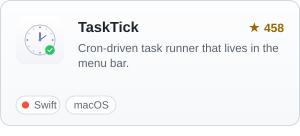
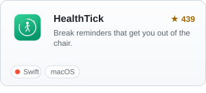
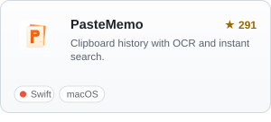
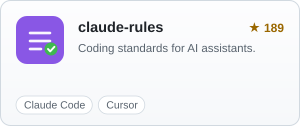
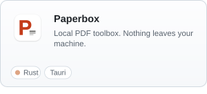
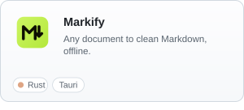

  <picture>
    <source media="(prefers-color-scheme: dark)" srcset="./assets/banner-dark.svg">
    <source media="(prefers-color-scheme: light)" srcset="./assets/banner-light.svg">
    
  </picture>

 

  <b>I build and ship complete products on my own</b> 
  Database schema to app icon. CI pipeline to release notes.

 

  <picture>
    <source media="(prefers-color-scheme: dark)" srcset="./assets/stats-dark.svg">
    
  </picture>

 

<!-- 卡片必须整张包进 <a>：SVG 以  加载时，图内部的 <a> 是点不动的 -->

  <a href="https://github.com/lifedever/TaskTick"><picture><source media="(prefers-color-scheme: dark)" srcset="./assets/cards/tasktick-dark.svg"></picture></a>
  <a href="https://github.com/lifedever/health-tick-release"><picture><source media="(prefers-color-scheme: dark)" srcset="./assets/cards/healthtick-dark.svg"></picture></a>
  <a href="https://github.com/lifedever/PasteMemo-app"><picture><source media="(prefers-color-scheme: dark)" srcset="./assets/cards/pastememo-dark.svg"></picture></a>
  <a href="https://github.com/lifedever/claude-rules"><picture><source media="(prefers-color-scheme: dark)" srcset="./assets/cards/claude-rules-dark.svg"></picture></a>
  <a href="https://github.com/lifedever/paperbox"><picture><source media="(prefers-color-scheme: dark)" srcset="./assets/cards/paperbox-dark.svg"></picture></a>
  <a href="https://github.com/lifedever/markify"><picture><source media="(prefers-color-scheme: dark)" srcset="./assets/cards/markify-dark.svg"></picture></a>

 

  <picture>
    <source media="(prefers-color-scheme: dark)" srcset="./assets/stack-dark.svg">
    
  </picture>

 

  
    The banner is a hand-written SVG — no image, no JavaScript. The ring is my commit volume by hour of
    day; the grid is the last year of contributions. Both are rebuilt from the GitHub API every morning
    by <a href="./.github/workflows/refresh.yml">a scheduled Action</a>.
      
    <a href="https://www.lifedever.com">lifedever.com</a> &nbsp;·&nbsp;
    <a href="https://github.com/lifedever?tab=repositories">All repositories</a>
  

